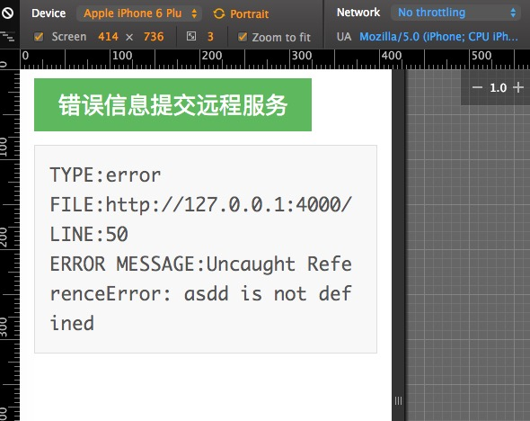
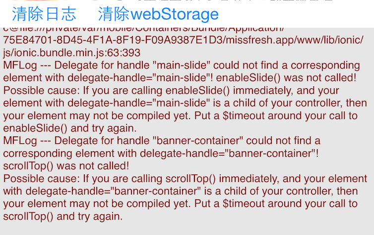

## cm.logger

JavaScript错误捕获，日志展示插件，不依赖任何库或框架，可选择在网页中展示，也可以在Native控制台中展示日志。

### 效果图


---

---

### 使用

**注明：目前Native端只实现了iOS，使用NSURLProtocol**

方式一：在网页输出日志与错误信息

> 直接引入cm.logger.js，cm.logger.css


方式二：在iOS端输出日志与错误信息

- 需要在你的index.html中引入cm.logger.js，不需要cm.logger.css文件。
- 在你的Xcode中导入CMLoggerNative这个目录下的所有文件。

```Objective-C
+(void)managerApp:(UIView *)subMFLogView managWebView:(UIWebView *)webview;
```

使用[CMLogger readConfig:^(NSDictionary *debugConfig) {}]读取配置文件，在这个Block中，把CMLogger注册进去。并且创建自己的UIView以及传递被接管App的UIWebView对象给注册方法，注册方法会持久持有，至此CMLogger会全面接管App的网络，以及UI界面。

例子：

```Objective-C
__weak AppDelegate *weakSelf = self;
[MFLog readConfig:^(NSDictionary *debugConfig) {
    NSNumber *openCMLogger = debugConfig[@"openCMLogger"];
    static NSInteger mTop = 260;
    if (openCMLogger) {
        if ([openCMLogger intValue] != 0) {
            CGRect mainScreen = [[UIScreen mainScreen] bounds];
            CGFloat WKWebViewHeight = mainScreen.size.height - mTop;
            weakSelf.viewController.webView.frame = CGRectMake(0, 0, mainScreen.size.width, WKWebViewHeight);
            CGFloat debugY = self.viewController.webView.frame.size.height;
            UIView *subManagerView = [[UIView alloc] initWithFrame:CGRectMake(0, debugY, mainScreen.size.width, mTop)];
            subManagerView.backgroundColor = [UIColor whiteColor];
            [weakSelf.viewController.view addSubview:subManagerView];
            [CMLogger managerApp:subManagerView managWebView:weakSelf.viewController.webView];
        }
    }
}];
```

### JavaScript API

- log 传入一个任意数据，都将打印此字符串，undefined，null，NaN除外，此log不会展开递归。
- intensify 传入一个任意的数据，都将打印此字符串，如果是对象将展开递归，undefined，null，NaN除外。
- addTarget 网页版可用，传入一个事件回调，用于发送到服务端，无法修改事件，默认click。
- info 属性一个刷新周期内所打印或捕获的所有日志或错误信息。

```JavaScript
CMLogger.addTarget(function(e){
	//处理请求
});
```